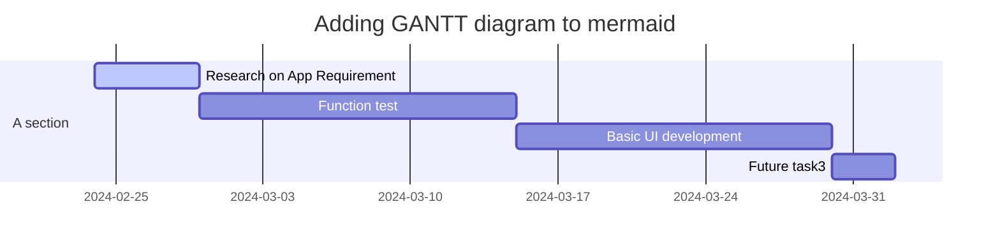

# Life OS
Life OS is an life changing application that allows you to keep track of your daily activities. 

## Features
1. Todo
2. Task / Project tracking
3. Calander with event tracking
4. Expense tracker
5. Map navigator
6. Health monitoring

## User Stories
1. **To-do**
   - ==***User can create a new To-do***== so that app can store what user have to do
   - ==***The app can send a notification to user***== so that user are remind of what to do
2. **Task / Project tracking**
   - ==***User can create a new Task / Project***== so that app can store what task user have to do currently and keep track of it.
   - ==***User can sets the status of the task***== so that user can filter or sort the task list by their status
   - ==***The app provide the search ability***== so that user can search through the task list by their name, status
   - ==***The app can send a notification to user***== so that user can be reminded of what task user have to do and the deadline.
   - ==***User can records down the details of the task / project***== so that user can review the details of the task at the future.
   - ==***User can sets the deadline of the task***== so that user can be notified when deadline is reached.
   - ==***The app can generate a gantt chart of the tasks***== so that user can review all the tasks and their status on a timeline.
   - ==***The task can be added to the calendar***== so that user can view the task at the calendar
3. **Calendar with event tracking**
   - ==***User can view the calendar***== so that user can can know what is the data today, day of week and other related information
   - ==***User can import the third-party calendars data***== so that user can see the events added in the third-party calendars at once
   - ==***User can export the calendars data to the third-party calendars***== so that user can see the calendar data in their preference calendar app
   - ==***User can create the event on the calendar***== so that user can keep track of the events
   - The ==***User can send notification to user***== so that user can be reminded the events that will happen recently

## First phase app features
1. Create account and login as user
2. To-do section

## Gannt Chart for the first phase development
